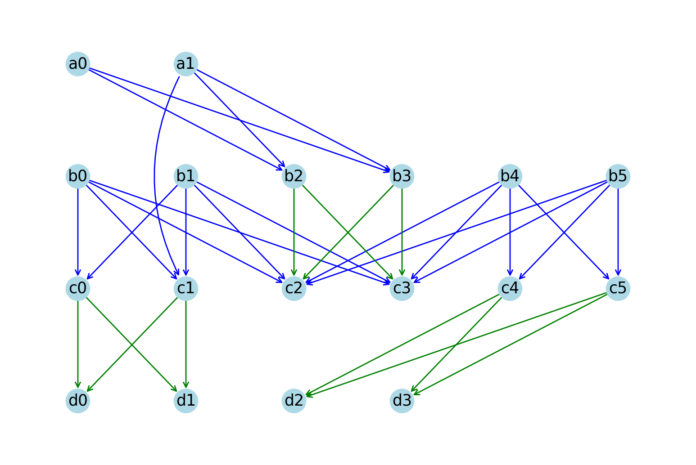
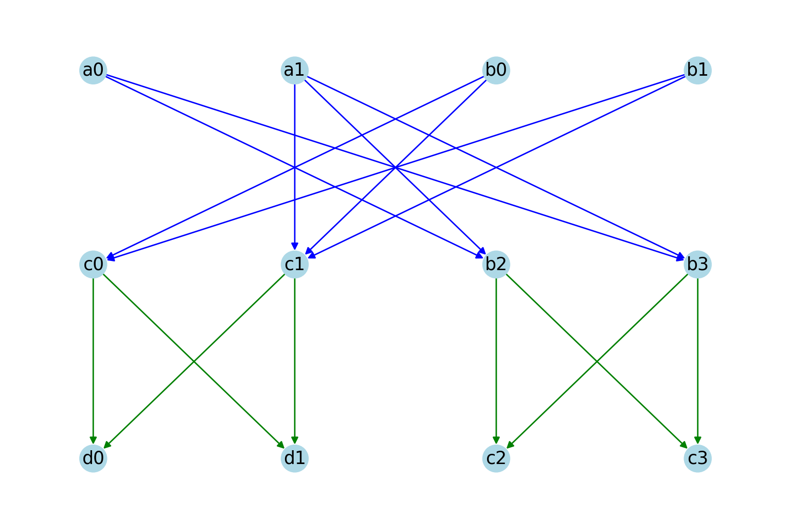
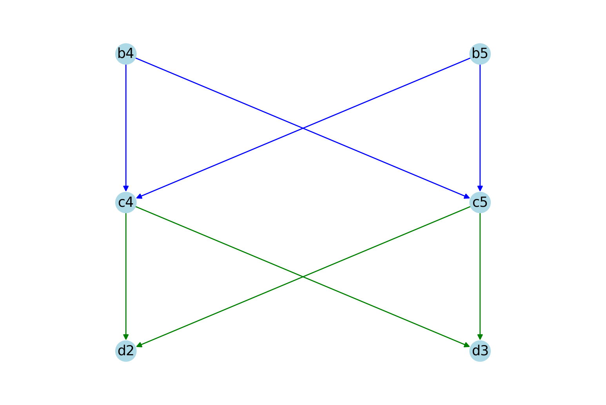

# MaxPathHomology
Zhu, Z. and Chi, Z. (2024). "*Recursive Computation of Path Homology for Stratified Digraphs*".

This repository provides a Python implementation of the above paper that recursively computes the maximal (reduced) path homology of an unweighted stratified graph or unweighted directed acyclic graph (DAG).

## Installation
To get started with this project, follow the steps below to install the necessary dependencies:

- **Python**: Ensure that `Python 3.10` or higher is installed. You can check your Python version by running:
    ```bash
    python --version
    ```
- **Clone the repository**:
    ```bash
    git clone https://github.com/zhengtongzhu/DAG_MaxPathHomology.git
    cd DAG_MaxPathHomology
    ```
- **Install dependencies**:
    ```bash
    pip install -r requirements.txt
    ```
- **Run the code**:
    ```bash
    python recursive_algorithm.py
    ```

    You will see the following output from the test example:

    ```python
    lp = 2,
    betti = 3,
    basis = [
                [(-b0 + b1)*((-c0 + c1)*(-c3 + d1) + (c0 - c1)*(-c3 + d0)), 
                 (-a0 + a1)*(-b2 + b3)*(c2 - c3)], 
                [(-b4 + b5)*(-c4 + c5)*(d2 - d3)]
            ]
    ```

## dag_preprocess.py
The `dag_preprocess.py` module provides functions to compute the longest path length `lp` and the stratified decomposition `G'` for a given unweighted DAG `G` without multiple edges. These methods are described in Section 5.2 of the paper.

### Example Usage
Consider a DAG `G` generated by the following `edges`:

```python
edges = [('a0', 'b2'), ('a0', 'b3'), ('a1', 'b2'), ('a1', 'b3'), ('a1', 'c1'),
         ('b0', 'c0'), ('b0', 'c1'), ('b1', 'c0'), ('b1', 'c1'), ('b2', 'c2'), 
         ('b2', 'c3'), ('b3', 'c2'), ('b3', 'c3'), ('b4', 'c4'), ('b4', 'c5'),
         ('b5', 'c4'), ('b5', 'c5'), ('b0', 'c2'), ('b0', 'c3'), ('b1', 'c2'),
         ('b1', 'c3'), ('b4', 'c2'), ('b4', 'c3'), ('b5', 'c2'), ('b5', 'c3'),
         ('c0', 'd0'), ('c0', 'd1'), ('c1', 'd0'), ('c1', 'd1'), ('c4', 'd2'),
         ('c4', 'd3'), ('c5', 'd2'), ('c5', 'd3')]

G = nx.DiGraph(edges)
```

Each tuple `(a, b)` in `edges` represents a directed unweighted edge in `G` from node `a` to node `b`:



The `dag_process` function first verifies that `G` is a nonempty NetworkX `DiGraph`, that it is not a `MultiDiGraph`, and that it is directed acyclic (based on [NetworkX](https://networkx.org/)). It then computes the longest path length of `G` by [dag_longest_path_length](https://networkx.org/documentation/stable/reference/algorithms/generated/networkx.algorithms.dag.dag_longest_path_length.html#networkx.algorithms.dag.dag_longest_path_length):

```python
lp = nx.dag_longest_path_length(G)
```
If `lp == 0`, then `G` has no directed edges and consists entirely of isolated vertices. The reduced $0$-th path homology has betti number `betti = #{vertices} - 1`.

For `lp >= 1`, `dag_process` first applies `graph_decomposition`
to construct the stratified subgraph `G'` consisting of all
longest directed paths of `G`. By Proposition 3.7 of the paper,

$$
H_{\ell(G)}(G) = H_{\ell(G)}(G').
$$

The function then applies cascade pruning to `G'` until no removable vertex remains. If pruning decreases the maximum path length, then the maximal path homology of the original graph `G` is trivial. 

Otherwise, the pruned graph is partitioned into weakly connected components `{G_i}`, by Corollary 3.5 and Proposition 3.7 of the paper, each `G_i` is a stratified directed graph. Since

$$
H_{\ell(G)}(G) \cong \bigoplus_i H_{\ell(G)}(G_i),
$$

the maximal path homology can be computed separately on the retained
components `G_i` and then combined by direct sum.

For the DAG `G` above, edges `('b0', 'c2')`, `('b0', 'c3')`, `('b1', 'c2')`, `('b1', 'c3')`, `('b4', 'c2')`, `('b4', 'c3')`, `('b5', 'c2')` and `('b5', 'c3')` are removed by `graph_decomposition`. The resulting graph is split into two weakly connected components `G_0` and `G_1`:

```python
G_0 contains the following edges: 
    [('a0', 'b2'), ('a0', 'b3'), ('a1', 'b2'), ('a1', 'b3'), ('a1', 'c1'),
     ('b2', 'c2'), ('b2', 'c3'), ('b3', 'c2'), ('b3', 'c3'),
     ('b0', 'c0'), ('b0', 'c1'), ('b1', 'c0'), ('b1', 'c1'),
     ('c0', 'd0'), ('c0', 'd1'), ('c1', 'd0'), ('c1', 'd1')]

G_1 contains the following edges: 
    [('b4', 'c4'), ('b4', 'c5'), ('b5', 'c4'), ('b5', 'c5'),
     ('c4', 'd2'), ('c4', 'd3'), ('c5', 'd2'), ('c5', 'd3')]
```
The visual representation of these two components is shown below:

<div style="display: flex; justify-content: space-around; align-items: center;">
  <div style="width: 50%; text-align: center;">
    
    <p> G_0</p>
  </div>
  <div style="width: 50%; text-align: center;">
    
    <p> G_1</p>
  </div>
</div>


The `dag_process` function returns five objects:

```python
subgraph_dict, node_counts, lp, num_graphs, graph_list = dag_process(G)
```

- The $i^{th}$ element of `subgraph_dict` is a dictionary that represents `G_i`, where each key is a layer index (starting from `0`) and the value corresponding to the key is the set of nodes in that layer. For example, for the graph `G` above, the `subgraph_dict` is:

```python
subgraph_dict = [
    {0: {'b1', 'a1', 'b0', 'a0'}, 1: {'c1', 'b2', 'b3', 'c0'}, 2: {'c2', 'c3', 'd1', 'd0'}},
    {0: {'b5', 'b4'}, 1: {'c5', 'c4'}, 2: {'d3', 'd2'}}
    ]
```
`c2` is a node in subgraph `G_0`'s `2`nd layer and `c4` is a node in subgraph `G_1`'s `1`st layer.

- The `i`$^{th}$ element of `node_counts` represents the number of nodes in the different layers of `G_i`. From the `subgraph_dict` above, we know that

```python
node_counts = [[4, 4, 4], [2, 2, 2]]
```
where `[4, 4, 4]` means `G_0` has `4` nodes in layer `0`, `4` nodes in layer `1`, and `4` nodes in layer `2`.

- `lp` is the longest path length of `G` as described above. Here `lp = 2`.
- `num_graphs` is the number of components `G_i`. Here `num_graphs = 2`.
- `graph_list` is a list where each element `G_i` is stored as an instance of the `nx.DiGraph` class.

## recursive_algorithm.py
The `recursive_algorithm.py` module contains the main algorithm `max_path_homology` to compute the maximal path homology for an unweighted stratified graph. Along with `dag_preprocess.py`, it also works for unweighted DAGs.

The `max_path_homology` returns `lp`, `betti` and `basis`.
```python
lp, betti, basis = max_path_homology(G, calculate_basis)
```
Here:
- `lp` is the longest path length of `G`.
- `betti` is the sum of the Betti numbers of the `lp`-dimensional (maximal) path homologies of all `G_i`.
- If `calculate_basis == True`, then `basis` returns a list of component-wise basis lists. Each inner list contains the basis generators associated with one weakly connected component `G_i`. The total number of generators across all inner lists equals `betti`. Returns `None` if `calculate_basis == False`.

For `calculate_basis == True`, the outputs are:
```python
lp = 2,
betti = 3,
basis = [
         [(-b0 + b1)*((-c0 + c1)*(-c3 + d1) + (c0 - c1)*(-c3 + d0)), 
          (-a0 + a1)*(-b2 + b3)*(c2 - c3)], 
         [(-b4 + b5)*(-c4 + c5)*(d2 - d3)]
        ]
```
## general_algorithm.py
`general_algorithm.py` is based on an implementation from the following project:

Carranza, D., Doherty, B., Kapulkin, K., Opie, M., Sarazola, M., & Wong, L. Z. (2022). *Python script for computing path homology of digraphs* (Version 1.0.0) [Computer software]. https://github.com/sheaves/path_homology.

This project implements a general algorithm for computing reduced path homology. If you run this project or its comparative implementation in your work, please also cite the above project to acknowledge their contributions.

## Other Modules
`maxpph.py`: Produces a decreasing persistence path homology plot (Section 6.2 of the paper).

`experiment_func.py`, `stratified_gamma_1_2_3.py` and `stratified_gamma_4_5.py`: Implement additional functions and simulations discussed in Section 6.1 of the paper.

`maxph_matrix.py`: Contains functions for matrix operations.

## Citation
If you find this code useful, please cite it using the following BibTeX entry:

```bibtex
@software{Zhu_Computing_the_maximal_2024,
author = {Zhu, Zhengtong and Chi, Zhiyi},
month = dec,
title = {{Computing the maximal path homology of directed acyclic graph}},
url = {https://github.com/zhengtongzhu/DAG_MaxPathHomology},
version = {1.0.0},
year = {2024}
}
```